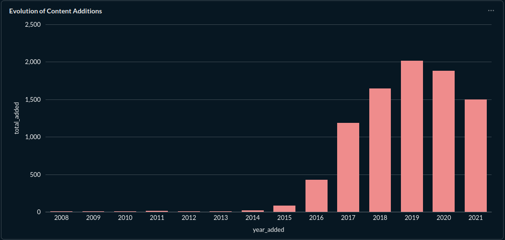
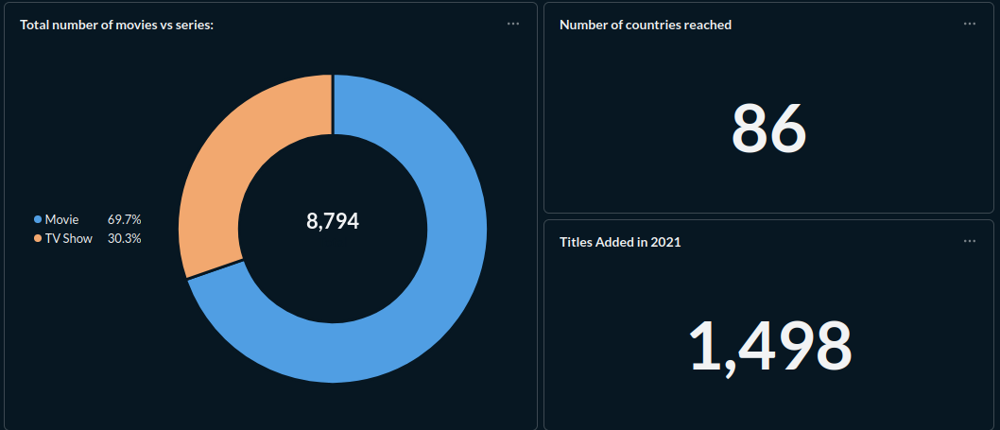
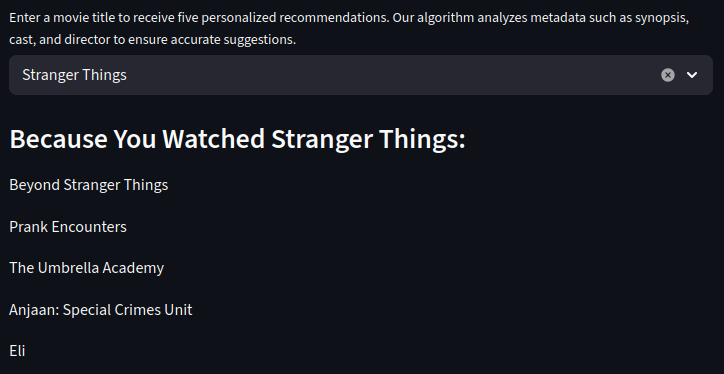

Projeto: https://ryan-portfolio-movie-recommender.streamlit.app/

Arquivo csv: https://www.kaggle.com/datasets/shivamb/netflix-shows/data

O projeto utiliza um dataset do Kaggle contendo o catálogo de títulos da Netflix até 2021 para criar um ecossistema de análise e recomendação. O fluxo começa com o tratamento de dados brutos via Pandas, onde limpei inconsistências em campos de elenco, direção e datas. Para garantir uma estrutura mais robusta que um simples CSV, utilizei o SQLAlchemy para persistir esses dados em um banco relacional SQLite.

*Com a base estruturada, utilizei o Docker para subir uma instância do Metabase, onde conectei o banco de dados para construir dashboards de análise exploratória, monitorando a distribuição de gêneros e o volume de lançamentos por país.

Visualização dos Dados (Metabase):
   
   
   

A inteligência de recomendação foi implementada com o Scikit-Learn, utilizando processamento de linguagem natural (NLP). O algoritmo combina sinopse, elenco e direção em uma "sopa de metadados" que é convertida em vetores numéricos via TF-IDF. A partir disso, o sistema calcula a Similaridade de Cosseno entre os títulos para entregar as 5 recomendações tecnicamente mais próximas da escolha do usuário.

Por fim, a solução foi publicada em uma interface interativa com Streamlit, utilizando um sistema de cache e serialização (Pickle) para que o modelo de recomendação responda instantaneamente sem necessidade de reprocessamento.
  

Nota: Este é um projeto de portfólio para fins de estudo, utilizando dados públicos do Kaggle. Não possui vínculo oficial com a Netflix.

